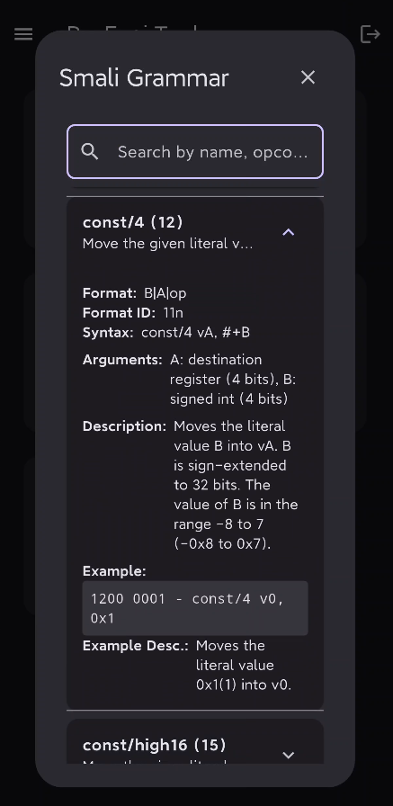
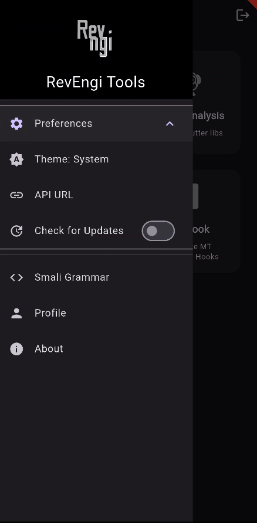
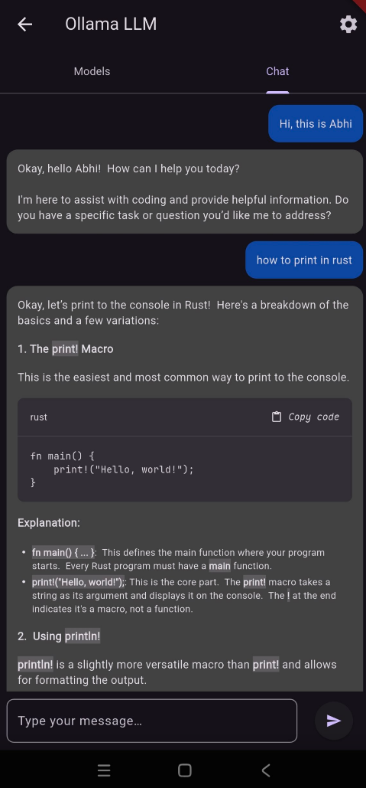

<h1>RevEngi App</h1>
  
<a href="https://apps.obtainium.imranr.dev/redirect?r=obtainium://app/%7B%22id%22:%22org.revengi.app%22,%22url%22:%22https://github.com/RevEngiSquad/revengi-app%22,%22author%22:%22RevEngiSquad%22,%22name%22:%22RevEngi%20App%22,%22preferredApkIndex%22:0,%22additionalSettings%22:%22%7B%5C%22includePrereleases%5C%22:false,%5C%22fallbackToOlderReleases%5C%22:true,%5C%22filterReleaseTitlesByRegEx%5C%22:%5C%22%5C%22,%5C%22filterReleaseNotesByRegEx%5C%22:%5C%22%5C%22,%5C%22verifyLatestTag%5C%22:false,%5C%22dontSortReleasesList%5C%22:false,%5C%22useLatestAssetDateAsReleaseDate%5C%22:false,%5C%22releaseTitleAsVersion%5C%22:false,%5C%22trackOnly%5C%22:false,%5C%22versionExtractionRegEx%5C%22:%5C%22%5C%22,%5C%22matchGroupToUse%5C%22:%5C%22%5C%22,%5C%22versionDetection%5C%22:true,%5C%22releaseDateAsVersion%5C%22:false,%5C%22useVersionCodeAsOSVersion%5C%22:false,%5C%22apkFilterRegEx%5C%22:%5C%22%5C%22,%5C%22invertAPKFilter%5C%22:false,%5C%22autoApkFilterByArch%5C%22:true,%5C%22appName%5C%22:%5C%22%5C%22,%5C%22shizukuPretendToBeGooglePlay%5C%22:false,%5C%22allowInsecure%5C%22:false,%5C%22exemptFromBackgroundUpdates%5C%22:false,%5C%22skipUpdateNotifications%5C%22:false,%5C%22about%5C%22:%5C%22%5C%22%7D%22,%22overrideSource%22:null%7D">
  
</a>
  
  

## Features

RevEngi App encompasses a variety of functionalities, including:

*   **JNI Analysis:** Extract JNI signatures from APK files to understand native method interfaces.
*   **Flutter Analysis:** Analyze Flutter libraries to gain insights into application structure and behavior.
*   **Blutter:** A dedicated tool for in-depth analysis of Flutter binaries.
*   **MT Hook:** Generate MT Enhanced Hooks for advanced instrumentation and modification.
*   **Dex Repair:** Repair corrupted DEX files to salvage and analyze application code.
*   **Smali Grammar Reference:** Quick & Advanced access to Smali instruction set like their opcode, format, and description for code analysis and manipulation. Examples are also provided where applicable.
*   **Local LLM:** On-Device AI chat with Llama, Qwen, Gemma & more with chat history support. Your data stays on your device. Customize `baseUrl` to your ollama instance for remote access.
*   **Theme Customization:** Offers light, dark, and system-based theme options.
*   **API Key:** Get your API key from the profile section and use it to access [RevEngi API](https://revengi.in/docs/api), integrate it with your own tools and scripts.

## Downloads

| Android                                                                                                                                                                                                        | Windows                                                                                                                                                                                                                                                                                                                                                                                                                                                                                                                                                                                                                                                                                                                                                           | Linux                                                                                                                                                                                             | Web                                                                                                                             |
| -------------------------------------------------------------------------------------------------------------------------------------------------------------------------------------------------------------- | ----------------------------------------------------------------------------------------------------------------------------------------------------------------------------------------------------------------------------------------------------------------------------------------------------------------------------------------------------------------------------------------------------------------------------------------------------------------------------------------------------------------------------------------------------------------------------------------------------------------------------------------------------------------------------------------------------------------------------------------------------------------- | ------------------------------------------------------------------------------------------------------------------------------------------------------------------------------------------------- | ------------------------------------------------------------------------------------------------------------------------------- |
|  |  |  |  |

You can get the latest release from our website [here](https://revengi.in/downloads).

Alternatively, you can download the latest/past release(s) from the [Releases](https://github.com/RevEngiSquad/revengi-app/releases) page.

> [!NOTE]
> Make sure to verify the checksum of the downloaded file to ensure its integrity.

## Reproducible Builds

RevEngi App ensures completely reproducible builds. Reproducible builds are a set of software development practices that create an independently-verifiable path from source to binary code. [Find out more](https://reproducible-builds.org/docs/definition/)

### Why Reproducible Builds Matter
In short: Reproducible Builds provide certainty that software is genuine and has not been tampered with. Learn more at [reproducible-builds.org](https://reproducible-builds.org/).

You can verify our builds in two ways:
- Check the build logs at [IzzyOnDroid's rbtlog](https://codeberg.org/IzzyOnDroid/rbtlog/src/branch/izzy/log/logs/org.revengi.app.json)
- Verify yourself using [rbuilder_setup](https://codeberg.org/IzzyOnDroid/rbuilder_setup)

## Screenshots

| Splash                                                                   | Home                                                                   | Profile                                                                   |
| ------------------------------------------------------------------------ | ---------------------------------------------------------------------- | ------------------------------------------------------------------------- |
|  |  |  |

| Smali Grammar                                                                   | SideBar                                                                             | AI Chat                                                                   | Manage Models                                                                   |
| ------------------------------------------------------------------------------- | ----------------------------------------------------------------------------------- | ------------------------------------------------------------------------- | ------------------------------------------------------------------------------- |
|  |  |  |  |

## Roadmap

The RevEngi App project is continuously evolving.  Future plans include:

*   **Feature Parity:** Implementing remaining features available in the original RevEngi BOT within the app.
*   **Offline Capabilities:** Transitioning more features (like MT Hook and others) to operate entirely client-side for offline use.

## Contributing

Contributions to RevEngi App are welcome!  Please see [CONTRIBUTING.md](CONTRIBUTING.md) for guidelines on how to contribute.

## Hacking

To get started with hacking on RevEngi App, please refer to the [HACKING.md](HACKING.md) file.

## License

RevEngi App is released under the [MIT License](LICENSE).

The application utilizes several open-source libraries; their respective licenses can be found within the app in the "About" section.

-----------

Made with ⌨️, 🖱 & ❤️ by [RevEngi](https://github.com/RevEngiSquad).
