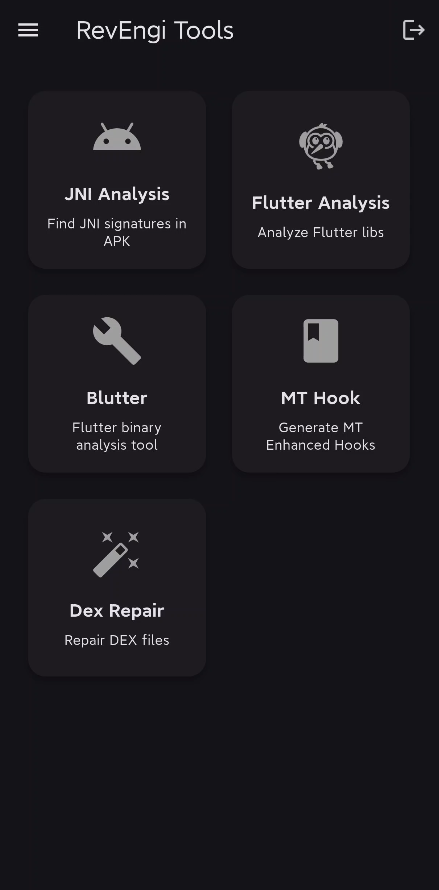
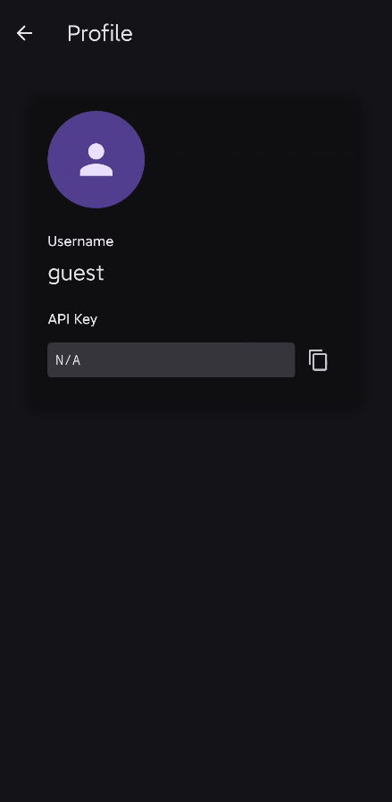
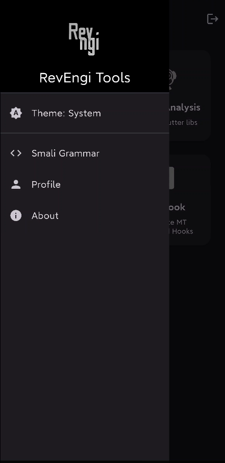

<h1>RevEngi App</h1>

## Features

RevEngi App encompasses a variety of functionalities, including:

*   **JNI Analysis:** Extract JNI signatures from APK files to understand native method interfaces.
*   **Flutter Analysis:** Analyze Flutter libraries to gain insights into application structure and behavior.
*   **Blutter:** A dedicated tool for in-depth analysis of Flutter binaries.
*   **MT Hook:** Generate MT Enhanced Hooks for advanced instrumentation and modification.
*   **Dex Repair:** Repair corrupted DEX files to salvage and analyze application code.
*   **Smali Grammar Reference:** Quick & Advanced access to Smali instruction set like their opcode, format, and description for code analysis and manipulation. Examples are also provided where applicable.
*   **Theme Customization:** Offers light, dark, and system-based theme options.
*   **API Key:** Get your API key from the profile section and use it to access RevEngi API, integrate it with your own tools and scripts.

## Downloads

| Android                                                                                                                                                                                                        | Windows                                                                                                                                                                                                                                                                                                                                                                                                                                                                                                                                                                                                                                                                                                                                                           | Linux                                                                                                                                                                                             | Web                                                                                                                             |
| -------------------------------------------------------------------------------------------------------------------------------------------------------------------------------------------------------------- | ----------------------------------------------------------------------------------------------------------------------------------------------------------------------------------------------------------------------------------------------------------------------------------------------------------------------------------------------------------------------------------------------------------------------------------------------------------------------------------------------------------------------------------------------------------------------------------------------------------------------------------------------------------------------------------------------------------------------------------------------------------------- | ------------------------------------------------------------------------------------------------------------------------------------------------------------------------------------------------- | ------------------------------------------------------------------------------------------------------------------------------- |
|  |  |  |  |

You can get the latest release from our website [here](https://revengi.in/downloads).

Alternatively, you can download the latest/past release(s) from the [Releases](https://github.com/RevEngiSquad/revengi-app/releases) page.

> [!NOTE]
> Make sure to verify the checksum of the downloaded file to ensure its integrity.

## Screenshots

| Splash                                       | Home                                     | Profile                                        | Smali Grammar                                       | Navigation Drawer                                        |
| -------------------------------------------- | ---------------------------------------- | ---------------------------------------------- | --------------------------------------------------- | -------------------------------------------------------- |
|  |  |  |  |  |

## Roadmap

The RevEngi App project is continuously evolving.  Future plans include:

*   **Feature Parity:** Implementing remaining features available in the original RevEngi BOT within the app.
*   **Offline Capabilities:** Transitioning more features (like MT Hook and others) to operate entirely client-side for offline use.

## Contributing

Contributions to RevEngi App are welcome!  Please see [CONTRIBUTING.md](CONTRIBUTING.md) for guidelines on how to contribute.

## License

RevEngi App is released under the [MIT License](LICENSE).

The application utilizes several open-source libraries; their respective licenses can be found within the app in the "About" section.